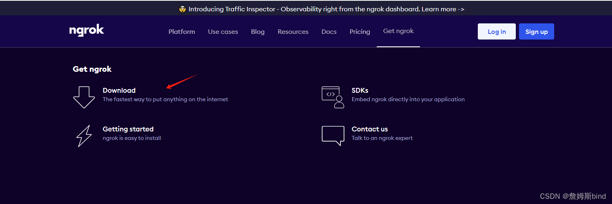
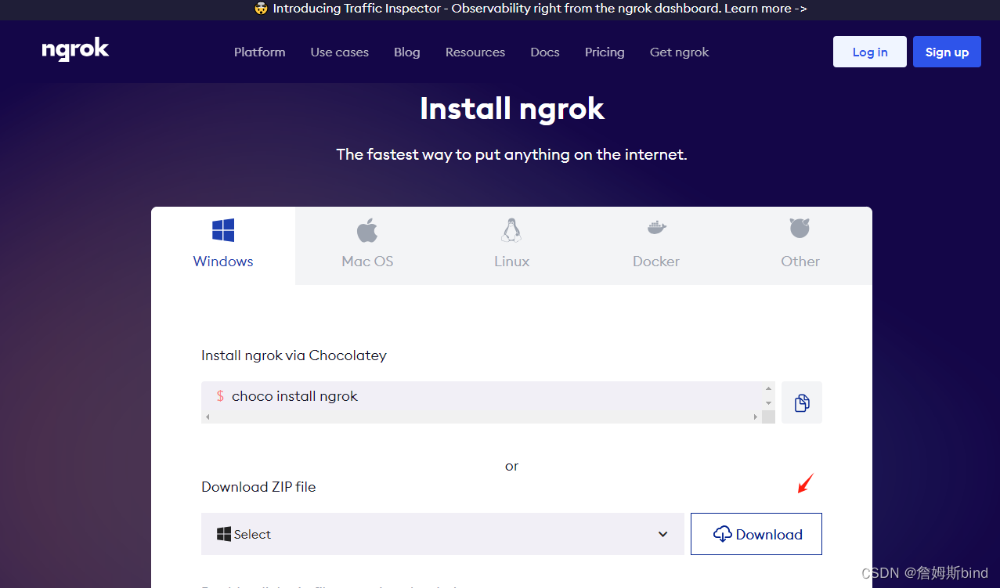
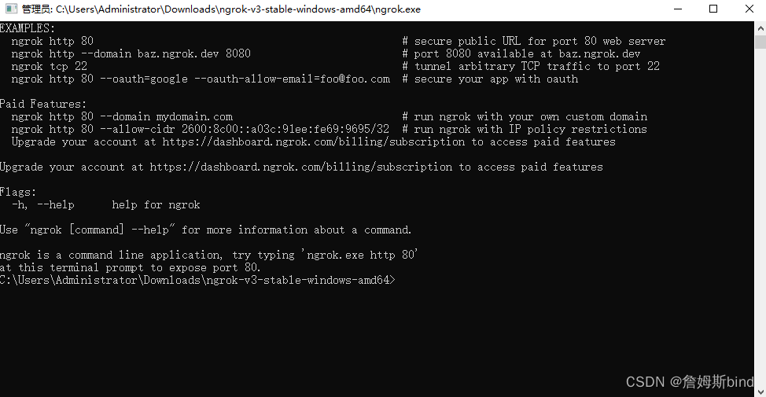
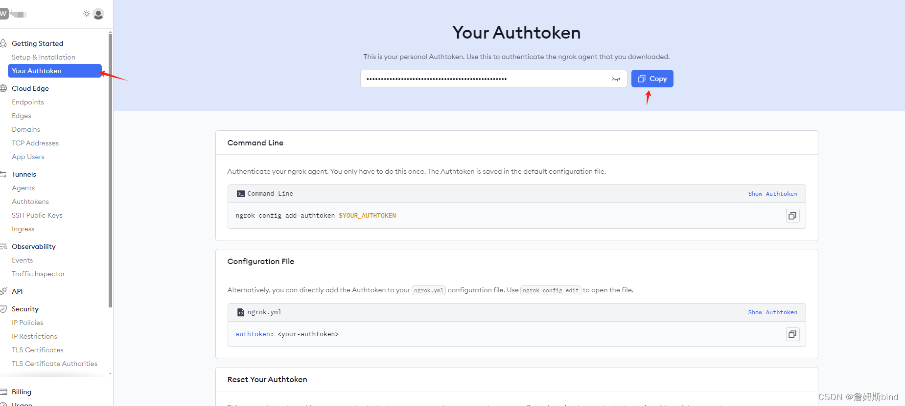
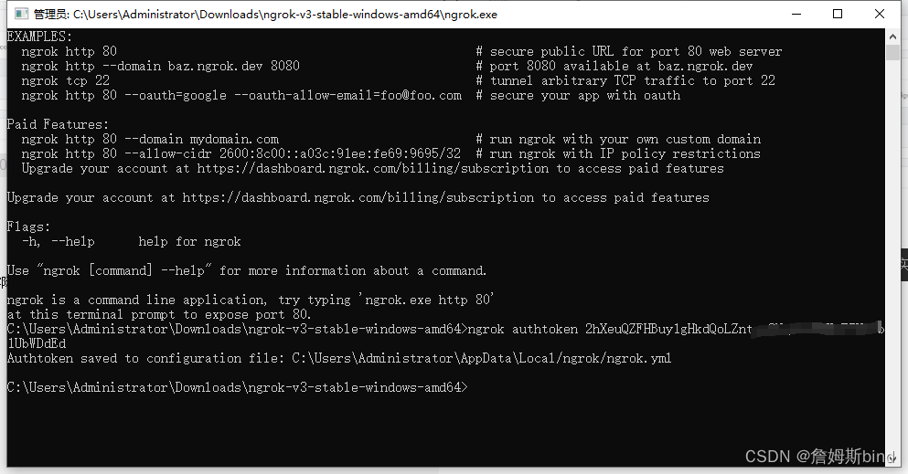
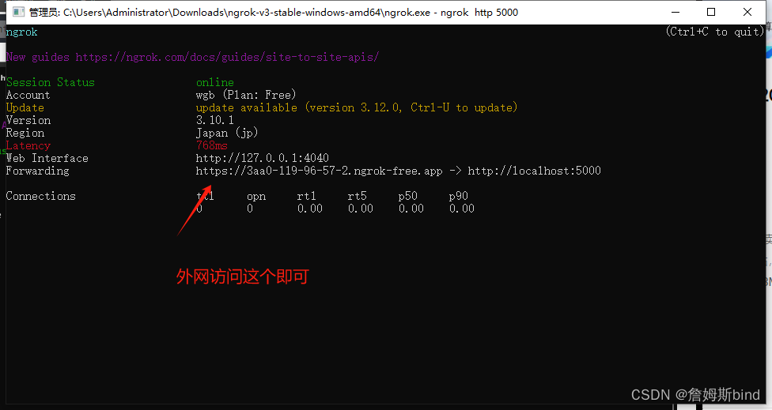
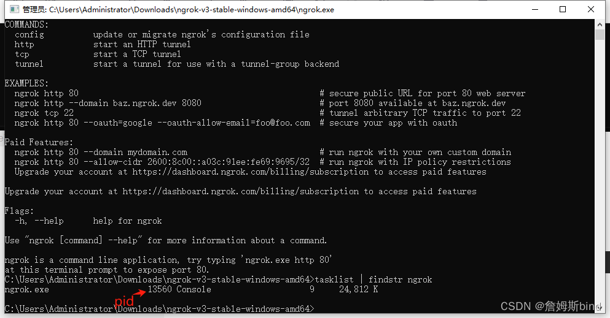
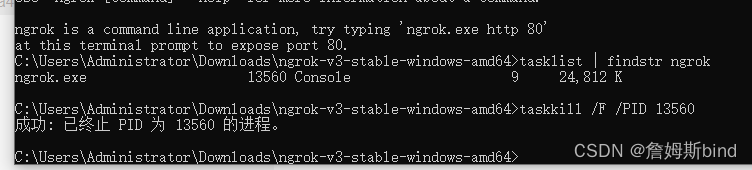

## 使用 Ngrok 实现 Windows 内网穿透，轻松实现公网访问本地服务

### 何为内网穿透？

内网穿透（NAT 穿透）是一种技术，用于让位于内网中的设备可以被外网（互联网）访问。内网穿透解决了局域网中的设备因为私有 IP 地址无法被外网直接访问的问题。通常情况下，内网设备通过路由器或防火墙连接到互联网，而这些设备往往会使用网络地址转换（NAT）来管理网络流量。这导致了内网设备的 IP 地址对外网不可见，从而无法直接从外网访问这些设备。

### 内网穿透实现的几种方式：

- 端口映射（Port Forwarding）： 在路由器上配置，将外部请求的特定端口映射到内网设备的相应端口。这样，当外部设备访问路由器的公网 IP 地址和特定端口时，路由器会将请求转发到内网设备上。

- 反向代理（Reverse Proxy）： 使用一个公网服务器作为中介，将外部请求转发到内网设备。例如，Nginx 或 Apache 可以配置为反向代理服务器，接收来自外部的请求并将其转发到内网设备。

- 动态域名系统（DDNS）： 结合端口映射，使用 DDNS 服务将动态变化的公网 IP 地址绑定到一个固定的域名，从而使内网设备可以通过该域名进行访问。

- 第三方服务（如 Ngrok）： Ngrok 等第三方服务通过在本地设备上运行一个客户端程序，将本地服务隧道到其公共服务器上，并分配一个临时的公网地址或域名，使外部设备可以通过该地址或域名访问内网设备。

本文介绍如何使用 <code>Ngrok</code> 实现内网穿透：

### 1、安装 Ngrok

进入[官网](https://ngrok.com/) 鼠标移入 getNgrok 下拉下载工具, 下载后解压运行。


运行界面


### 2、注册配置 ngrok 秘钥

在官网注册 ngrok 账号 登录进入个人中心；

在工具窗口配置你的用户秘钥，

```javascript
ngrok authtoken 2hXeuQZFHBuy1gHkdQoLZntzwxxxxxxxxxxxxx(替换实际秘钥)
```

看到以下输入就表示配置成功


### 3、映射本地端口

执行以下命令进行端口映射

```javascript
ngrok http 5000
```



### 4、注意事项

避免外网无法访问请关闭 windows <code>防火墙</code>

### 5、ngrok 进程终止

工具窗口输入下面命令找打当前进程 PID（进程 ID）

```javascript
tasklist | findstr ngrok
```


使用以下命令终止进程

```javascript
taskkill /F /PID <PID>
```


另外一种方案就是重启电脑 🤣🤣🤣🤣🤣
