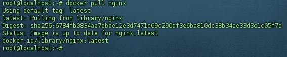
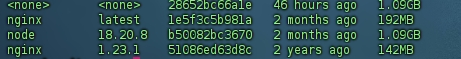

## 使用 .sh 脚本一键 在 docker 部署 web 项目

### 拉取镜像

```
docker pull nginx
```

出现以下输出即拉取成功

拉取完可通过 <code>docker images</code> 查看镜像列表


### 项目准备

例如 vite 项目 ，我们需要在更目录 添加 nginx 配置文件 default.conf 和 docker 配置文件 Dockerfile
分别写入一下内容

- default.conf

```
server {
    # 监听 IPv4 的 80 端口
    listen       80;
    # 监听 IPv6 的 80 端口
    listen  [::]:80;
    # 设置服务器名称，这里配置为本地主机
    server_name  localhost;
    # 引入 Nginx 预定义的 MIME 类型配置文件
    include mime.types;
    # 设置默认的 MIME 类型，当无法确定文件类型时使用
    default_type application/octet-stream;
    # 开启静态 GZIP 压缩，优先查找并返回 .gz 结尾的压缩文件
    gzip_static on;

    # 专门处理 .mjs 文件的配置块
    # ~* 表示不区分大小写的正则匹配，\.mjs$ 匹配所有以 .mjs 结尾的文件
    location ~* \.mjs$ {
        # 为 .mjs 文件设置正确的 JavaScript MIME 类型
        default_type application/javascript;
        # 设置文件根目录
        root /usr/share/nginx/html;
    }

    # 处理所有普通请求的主配置块
    location / {
        # 设置网站根目录
        root   /usr/share/nginx/html;
        # URI 请求的文件查找规则：
        # 1. 先找完整的 URI 路径
        # 2. 再找同名目录下的索引文件
        # 3. 都没有则返回 index.html（用于支持前端路由）
        try_files $uri $uri/ /index.html;
        # 设置默认索引文件
        index  index.html index.htm;
    }

    # API 代理配置块，用正则表达式匹配以 /graph-platform-api/ 开头的请求
    location ~ ^/graph-platform-api/(.*)$ {
        # 将请求代理到后端服务器，$1 捕获的是正则中的内容，$is_args$args 用于传递查询参数
        proxy_pass http://10.222.222:22/api/$1$is_args$args;
        # 设置连接超时时间为 3 秒
        proxy_connect_timeout 3;
        # 设置发送超时时间为 120 秒
        proxy_send_timeout 300;
        # 设置读取超时时间为 120 秒
        proxy_read_timeout 300;
        # 设置代理请求的 HTTP 头信息，用于传递客户端信息
        proxy_set_header X-Forwarded-Host \$host;
        proxy_set_header X-Forwarded-Server \$host;
        proxy_set_header X-Forwarded-For \$proxy_add_x_forwarded_for;
        # 设置客户端请求体的最大值为 100MB
        client_max_body_size 100m;
    }

    # 配置错误页面
    error_page   500 502 503 504  /50x.html;
    # 错误页面的具体处理配置
    location = /50x.html {
        # 错误页面存放的根目录
        root   html;
    }
}

```

- Dockerfile
  FROM nginx:1.23.1
  LABEL maintainer="username"
  EXPOSE 80
  COPY dist/ /usr/share/nginx/html/
  COPY default.conf /etc/nginx/conf.d/

### 服务器准备

服务器新建一个文件夹例如 app ，子级分别建一个 config 文件夹 和 application 文件夹

- 在 config 里放入之 nginx 配置文件
- 在 application 克隆仓库代码

### 编写一键部署脚本 deploy.sh

```
#!/bin/bash

# 设置超时时间（秒）
set timeout 30

# 设置 Git 凭证存储
git config --global credential.helper store

# 或者临时存储
# git config --global credential.helper cache --timeout=3600


# 执行git命令
git checkout .
git checkout branch
git pull origin branch


# 拉取依赖
pnpm install

# 打包
pnpm build:prod

if [ ! -d "dist" ]; then
  echo "❌ 构建失败，dist 目录未生成"
  exit 1
else
  echo "✅ 构建成功"
fi

# 镜像名称和版本
IMAGE_NAME="yaga:v1.0"

# 同时检查是否存在同名的容器和镜像，并删除
EXISTING_CONTAINER=$(docker ps -a -q --filter "ancestor=$IMAGE_NAME")
EXISTING_IMAGE=$(docker images -q $IMAGE_NAME)


if [ -n "$EXISTING_CONTAINER" ]; then
  echo "存在同名容器，正在删除..."
  docker rm -f $EXISTING_CONTAINER
fi

if [ -n "$EXISTING_IMAGE" ]; then
  echo "存在同名镜像，正在删除..."
  docker rmi -f $EXISTING_IMAGE
fi

# 根据 Dockerfile 创建新的 Docker 镜像
docker build -t $IMAGE_NAME .
echo "Docker 镜像 $IMAGE_NAME 创建完成"

# 启动容器
echo '正在启动容器'
docker run --name appContainer -d -p 8289:80 -v /app/config:/usr/share/nginx/html/config -v /app/config/default.conf:/etc/nginx/conf.d/default.conf -d appImage:v1.0

```

### 执行脚本

将脚本放入 application 根目录 后执行 chmod +x deploy.sh 进行赋权 ，再执行 bash deploy.sh 脚本
