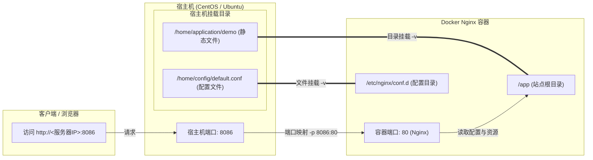
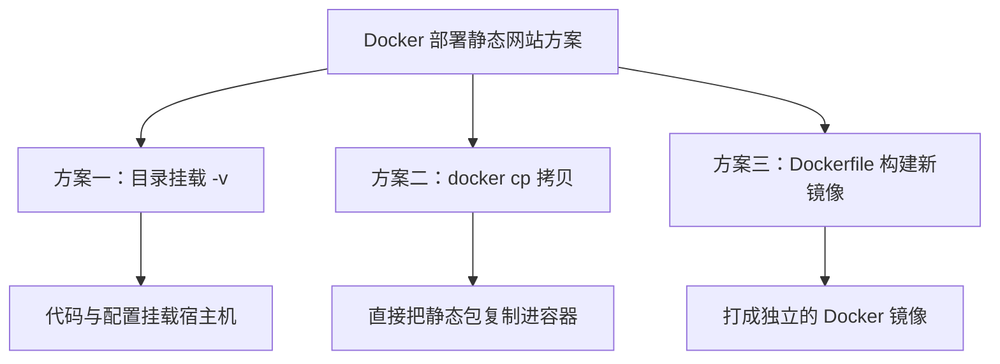

# Docker 实战：通过 Nginx 镜像部署静态网站

在日常开发与运维中，利用 Docker 部署静态网站（如 Vue/React 打包后的产物或 HTML 静态页）是一种高效、标准化且易于迁移的方式。

本文基于官方 **Nginx** 镜像，详细讲解如何通过**宿主机目录挂载（`-v`）**的方式快速构建并运行静态网站容器。

---

## 1. 部署原理与架构流向

通过 Docker 部署静态网站的核心在于：**端口映射**与**卷挂载（Volume Binding）**。

- **端口映射（`-p`）**：将宿主机（物理机/云服务器）的端口绑定到容器内部 Nginx 监听的 80 端口。
- **目录挂载（`-v`）**：将宿主机上的网页文件和配置文件映射到容器内，避免修改代码需要重新构建镜像的问题。



---

## 2. 步骤一：拉取 Nginx 镜像

首先在服务器终端检查并拉取 Docker Hub 上的官方 Nginx 镜像：

```bash
# 1. 查找官方 Nginx 镜像（可选）
docker search nginx

# 2. 拉取最新官方 Nginx 镜像
docker pull nginx

# 3. 查看本地镜像列表，确认拉取成功
docker images
```

输出示例如下：

```text
REPOSITORY   TAG       IMAGE ID       CREATED        SIZE
nginx        latest    a6be65181057   2 weeks ago    187MB
```

---

## 3. 步骤二：准备静态资源与 Nginx 配置

为了实现静态资源与配置在宿主机上的持久化管理，我们在宿主机上按如下结构组织目录。

### 3.1 创建宿主机目录结构

在宿主机的 `/home` 目录下分别建立 `application`（存放静态页面资源）与 `config`（存放 Nginx 配置）：

```bash
mkdir -p /home/application/demo
mkdir -p /home/config
```

总体目录树形图如下：

```text
/home/
├── application/
│   └── demo/
│       └── demo.html      # 网站静态 HTML 入口文件
└── config/
    └── default.conf       # 站点 Nginx 配置文件
```

### 3.2 准备静态页面 (`demo.html`)

在 `/home/application/demo/demo.html` 中写入示例页面代码：

```html
<!DOCTYPE html>
<html lang="zh-CN">
  <head>
    <meta charset="UTF-8" />
    <meta name="viewport" content="width=device-width, initial-scale=1.0" />
    <title>Docker Nginx 部署测试</title>
    <style>
      body {
        font-family:
          -apple-system, BlinkMacSystemFont, "Segoe UI", Roboto, sans-serif;
        display: flex;
        justify-content: center;
        align-items: center;
        height: 100vh;
        margin: 0;
        background: linear-gradient(135deg, #667eea 0%, #764ba2 100%);
        color: white;
      }
      .card {
        background: rgba(255, 255, 255, 0.1);
        backdrop-filter: blur(10px);
        padding: 2rem 3rem;
        border-radius: 16px;
        box-shadow: 0 8px 32px rgba(0, 0, 0, 0.2);
        text-align: center;
      }
      h1 {
        margin-bottom: 0.5rem;
      }
      p {
        opacity: 0.9;
      }
    </style>
  </head>
  <body>
    <div class="card">
      <h1>🚀 静态网站部署成功！</h1>
      <p>基于 Docker + Nginx 容器挂载运行</p>
    </div>
  </body>
</html>
```

### 3.3 准备 Nginx 配置文件 (`default.conf`)

在 `/home/config/default.conf` 中创建 Nginx 站点配置：

```nginx
server {
    listen       80;
    server_name  localhost;

    # 对应容器内部映射的静态文件路径 /app
    location / {
        root   /app;
        index  demo.html index.html index.htm;
        try_files $uri $uri/ /demo.html;
    }

    # 错误页面处理
    error_page   500 502 503 504  /50x.html;
    location = /50x.html {
        root   /usr/share/nginx/html;
    }
}
```

::: tip 提示
配置中的 `root /app;` 指的是**容器内部**的路径，后续在启动命令中我们会把宿主机的 `/home/application/demo` 挂载到容器内的 `/app` 目录。
:::

---

## 4. 步骤三：构建并启动 Docker 容器

### 4.1 执行启动命令

运行以下命令，使用官方 Nginx 镜像拉起容器并完成端口映射与目录挂载：

```bash
docker run -d \
  -p 8086:80 \
  -v /home/application/demo:/app \
  -v /home/config:/etc/nginx/conf.d \
  --name demo \
  nginx
```

执行成功后，终端将输出生成的容器 ID 字符串。

### 4.2 命令参数详解

| 参数项       | 参数值                           | 作用与解释                                                                                 |
| :----------- | :------------------------------- | :----------------------------------------------------------------------------------------- |
| `docker run` | -                                | 创建并启动一个新的容器                                                                     |
| `-d`         | -                                | **后台运行（Detached mode）**，防止关闭终端导致容器终止                                    |
| `-p`         | `8086:80`                        | **端口映射** `[宿主机端口]:[容器端口]`。将外部访问的 8086 端口转发给容器内部的 80 端口     |
| `-v`         | `/home/application/demo:/app`    | **目录挂载** `[宿主机源码目录]:[容器内目录]`。方便后续直接在宿主机修改网页，容器内实时生效 |
| `-v`         | `/home/config:/etc/nginx/conf.d` | **配置挂载**。将自定义的 Nginx 配置文件覆盖容器内的默认子配置                              |
| `--name`     | `demo`                           | **容器命名**。方便后续执行 `docker stop demo` 或 `docker logs demo` 管理                   |
| `nginx`      | `nginx`                          | **基础镜像名称**                                                                           |

---

## 5. 步骤四：服务验证与访问

### 5.1 查看正在运行的容器状态

执行命令查看容器是否正常运行：

```bash
docker ps
```

控制台输出示例：

```text
CONTAINER ID   IMAGE     COMMAND                  CREATED         STATUS         PORTS                  NAMES
b3f2e1a9c4d8   nginx     "/docker-entrypoint.…"   2 minutes ago   Up 2 minutes   0.0.0.0:8086->80/tcp   demo
```

看 `STATUS` 状态为 `Up` 且 `PORTS` 中成功映射了 `8086->80` 即代表容器正常启动。

### 5.2 浏览器访问测试

打开浏览器，访问 `http://<你的服务器公网IP>:8086`，即可看到刚部署的静态网页：

```text
+--------------------------------------------------+
| 🚀 静态网站部署成功！                              |
| 基于 Docker + Nginx 容器挂载运行                 |
+--------------------------------------------------+
```

---

## 6. 部署方案对比与拓展

在实际业务场景中，通过 Docker 部署静态网站主要有以下 **3 种常见方案**：

### 6.1 三种常见 Docker 部署静态网站模式对比



| 维度           | 1. 目录挂载方式 (`-v`)               | 2. 容器拷贝方式 (`docker cp`)        | 3. Dockerfile 打包构建镜像              |
| :------------- | :----------------------------------- | :----------------------------------- | :-------------------------------------- |
| **适用场景**   | 个人项目、单机部署、更新频繁的静态页 | 临时验证测试、不想在宿主机持久化挂载 | 团队 CI/CD 流水线、版本化发布、集群部署 |
| **更新方式**   | 直接替换宿主机文件（即时生效）       | 重新执行 `docker cp` 命令            | 重新 `docker build` 并发布镜像          |
| **数据持久化** | ✅ 支持，删容器后代码依然留在宿主机  | ❌ 不支持，容器删除后文件丢失        | ✅ 固化在镜像层中                       |
| **交付便利性** | 中等（需配置宿主机路径）             | 较低                                 | 极高（单个镜像即可跨平台开箱即用）      |

---

### 6.2 `docker cp` 复制模式补充

如果不希望挂载宿主机目录，也可直接将静态文件拷贝入运行中的 Nginx 默认目录：

```bash
# 1. 启动默认容器
docker run -d -p 8086:80 --name temp-nginx nginx

# 2. 从宿主机拷贝静态页面文件到容器内
docker cp /home/application/demo/demo.html temp-nginx:/usr/share/nginx/html/index.html
```

---

## 7. 常见问题与避坑指南

::: danger 踩坑排查 1：公网 IP + 端口无法访问？
**可能原因**：

1. **云厂商安全组未放行**：阿里云、腾讯云、华为云等安全组规则中未打开 `8086` 入方向端口。
2. **服务器系统防火墙未开放端口**：
   - CentOS (Firewalld)：`sudo firewall-cmd --zone=public --add-port=8086/tcp --permanent && sudo firewall-cmd --reload`
   - Ubuntu (UFW)：`sudo ufw allow 8086/tcp`
     :::

::: tip 提示 2：静态资源更新后页面不刷新？

- 检查 Nginx 是否开启了强缓存。若在 `default.conf` 中配置了资源缓存规则，更新静态文件后建议清理浏览器缓存或做版本号标记（Hash 文件名）。
  :::

::: warning 总结
采用 Docker 容器化部署静态网站不仅环境隔离性好，还能通过宿主机挂载技术大大简化日常发版维护。对于需要企业级自动发布的场景，可进一步将此流程写入 GitHub Actions 或 GitLab CI/CD 结合 Dockerfile 实现自动化部署。
:::
