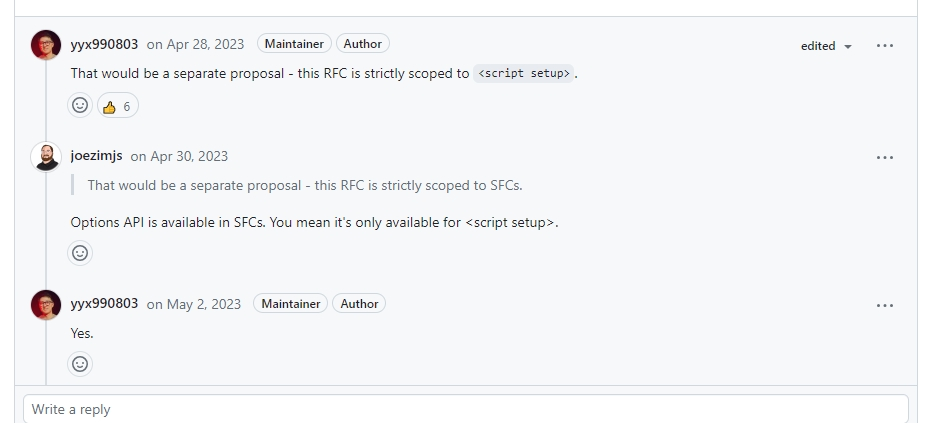

# v3.4-defindModel 初体验

### 彩蛋 🧐

在 vue3.3x 版本中 官方 [RFC](https://github.com/vuejs/rfcs/discussions/503) 放出了 一个新特性 defineModel，它将让我们在自定义组件上双向绑定数据更加快捷；

### 举个 🌰

以前我们父子组件双向数据绑定要在子组件里声明对应的 props、emts、computed。

```javascript
// 子组件.vue
<template>
    <p>{{ $msg }}</p>
</template>
<script lang="ts" setup>
const props = withDefaults(defineProps<{
    msg: string
}>(),{
    mag: () => ""
})

const emits = defineEmits(["update:msg"])

const $msg = component({
    get() {
        return props.msg;
    },
    set(value:string) {
        emits('update:msg',value)
    }
})
</script>

// 父组件.vue
<template>
    <div>
        <Child  v-model:msg="msg" />
    </div>

</template>

<script lang="ts" setup>
import {ref} from 'vue'
const msg = ref<string>('');

</script>
```

而 defineModel 的新写法，只需要子组件 1 行代码就行，是不是一下就清爽多了

```javascript
<template>
    <p>{{ $msg }}</p>
</template>
<script lang="ts" setup>
const $msg = defineModel<string>('msg',{default: ''})

</script>
```

### 注意 ❗

由于这个新特性是 v3 的实验性功能，目前开启此功能需要到 vite.config.js 中开启启用；vue-loader 也需要在 vue-loader@^17.1.1 上

```javascript
export default {
  plugins: [
    vue({
      script: {
        defineModel: true, // 启用
      },
    }),
  ],
};
```

还有此特性仅支持 <code> \<script setup></code>


